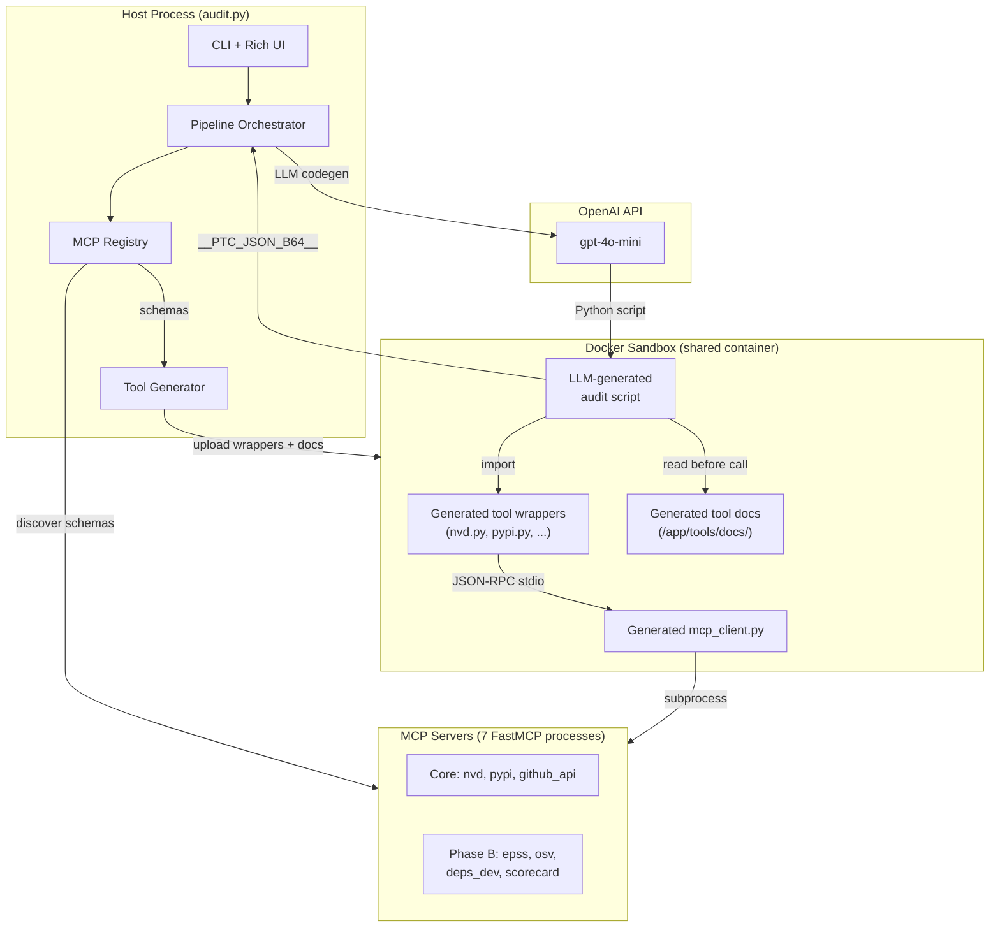
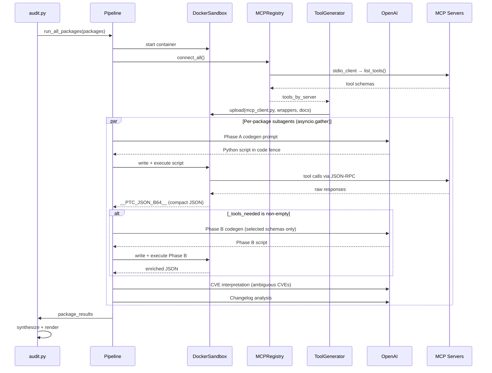
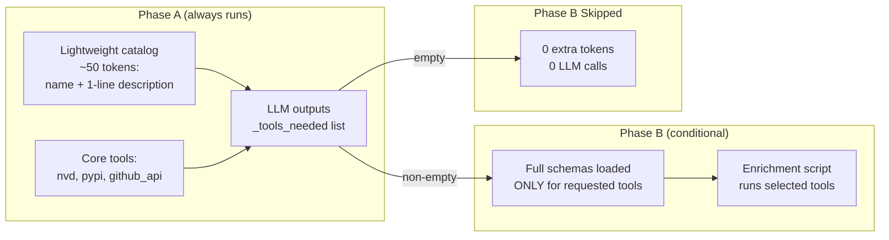
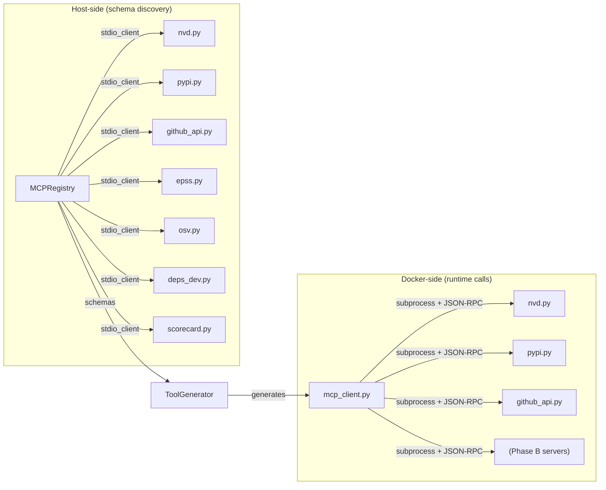
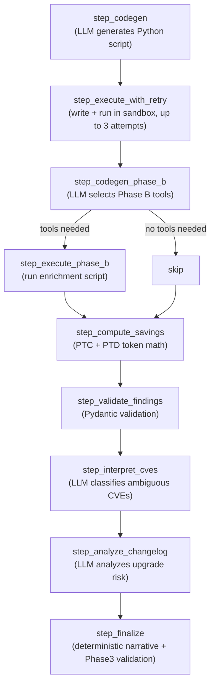

# Architecture

A Python dependency security auditor that uses **Programmatic Tool Calling (PTC)** and **Progressive Tool Discovery (PTD)** to minimize LLM token usage while producing accurate vulnerability assessments.

## Core Idea

Instead of a traditional ReAct loop where every tool call round-trips through the LLM, the LLM writes a Python script once. That script runs inside a Docker sandbox, calls all MCP tools directly, and returns a compact JSON summary. Raw tool responses never enter the LLM context window.

## System Overview



## Execution Flow



## Directory Structure

```
pypkg-audit-ptc-agent/
├── audit.py                    # CLI entrypoint, Rich UI, savings reports
├── config.yaml                 # MCP server definitions, Docker config
├── Dockerfile                  # Sandbox image (python:3.12-slim + uv)
├── pyproject.toml              # Dependencies
│
├── src/
│   ├── agent/
│   │   ├── pipeline.py         # Top-level orchestrator (shared sandbox, parallel dispatch)
│   │   ├── subagent.py         # Per-package step functions (codegen → execute → interpret)
│   │   ├── prompts.py          # All LLM prompts (Phase A, Phase B, interpretation, changelog)
│   │   ├── schema.py           # AuditContext dataclass, Pydantic models (CVEEntry, AuditFindings/PackageAuditResult)
│   │   ├── llm.py              # ChatOpenAI factory
│   │   ├── executor.py         # PTC output parser, container config rewriter
│   │   ├── synthesizer.py      # Cross-package prioritization and narrative
│   │   ├── planner.py          # Requirements file parser
│   │   ├── events.py           # Typed EventBus for Rich UI / SSE consumers
│   │   └── tool_catalog.py     # Lightweight tool catalog builder for PTD
│   │
│   ├── core/
│   │   ├── mcp_registry.py     # Connects to MCP servers, discovers tool schemas
│   │   └── tool_generator.py   # Generates sandbox-side wrappers, docs, and mcp_client.py
│   │
│   ├── mcp_servers/            # 8 FastMCP server implementations
│   │   ├── nvd.py              # NVD CVE API with CPE range matching
│   │   ├── pypi.py             # PyPI metadata (latest version, GitHub repo)
│   │   ├── github_api.py       # GitHub release notes
│   │   ├── epss.py             # FIRST EPSS exploit probability scores
│   │   ├── osv.py              # OSV vulnerability database
│   │   ├── deps_dev.py         # deps.dev dependency/advisory info
│   │   └── scorecard.py        # OpenSSF Security Scorecard
│   │
│   ├── sandbox/
│   │   └── docker_sandbox.py   # DockerSandbox: SandboxBackendProtocol implementation
│   │
│   └── config/
│       ├── core.py             # Pydantic config models
│       └── loaders.py          # YAML config loader
│
├── tests/
│   ├── test_ptd_selection.py   # PTD compliance, prompt structure, savings math
│   ├── test_event_bus.py       # EventBus fan-out, SSE format
│   └── test_wave1.py           # Step function imports, AuditContext defaults
│
├── requirements.txt            # Test fixture: single package (quick smoke test)
└── requirements-real-test.txt  # Test fixture: 6 packages (full demo)
```

## Key Patterns

### PTC (Programmatic Tool Calling)

The LLM never sees raw tool responses. Instead:

1. Host sends a codegen prompt describing available tools and expected output schema
2. LLM returns a Python script in a code fence
3. Host extracts the script, writes it to the Docker container, executes it
4. Script calls MCP tools inside the container via generated wrappers
5. Script outputs results as base64-encoded JSON via a `__PTC_JSON_B64__` marker
6. Host decodes the marker — raw tool payloads stay inside the sandbox

This eliminates tool-response tokens from the LLM context window entirely.

### PTD (Progressive Tool Discovery)

Not all tools are needed for every package. The system uses two-phase codegen:



**Phase A prompt** includes:
- Full response shapes for 3 core tools (nvd, pypi, github_api)
- Lightweight catalog of 4 Phase B tools (name + one-line description, no schemas)
- Instruction to output `_tools_needed` list based on audit findings

**Phase B prompt** (only if `_tools_needed` is non-empty):
- Full schemas loaded ONLY for the tools the LLM requested
- Core results passed via sandbox file (not embedded in prompt)

**Per-package variance:**
- Clean package (0 CVEs, recent version) → Phase B skipped, 0 extra tokens
- CVE-heavy package → Phase B loads 2-4 tool schemas for deeper investigation

### MCP Server Architecture

Each MCP server is a standalone FastMCP process communicating via JSON-RPC over stdio:



MCP servers run in two contexts:
1. **Host-side**: `MCPRegistry` connects to each server to discover tool schemas. These schemas feed into `ToolGenerator`.
2. **Docker-side**: `mcp_client.py` (generated) spawns MCP servers as subprocesses inside the container. The LLM-generated script imports generated wrappers which call `mcp_client.call_tool()`.

The same `.py` server files are uploaded to `/app/mcp_servers/` in the container.

### Per-Package Subagent Pipeline

Each package runs through these steps sequentially (packages run in parallel via `asyncio.gather`):



### CVE Classification

CVEs from NVD are pre-classified by the `search_cves` MCP tool:

| Status | Method | Meaning |
|--------|--------|---------|
| `affecting_pinned` | `cpe_range` | CPE version range confirms the CVE affects the pinned version |
| `not_relevant` | `cpe_range` | CPE range confirms the pinned version is outside the affected range |
| `needs_interpretation` | `heuristic` | Keyword match only, no CPE confirmation — sent to LLM for classification |

The LLM interpretation step reclassifies `needs_interpretation` CVEs as either `affecting_pinned` or `not_relevant` with `determination_method: "agent_interpretation"`.

### Output Schema

Each package produces a `PackageAuditResult`:

```
{
  "package": "requests",
  "pinned_version": "2.28.1",
  "latest_version": "2.32.5",
  "versions_behind": 4,
  "cves_affecting_pinned": [CVEEntry, ...],
  "cves_not_relevant": [CVEEntry, ...],
  "needs_interpretation": [],
  "total_cves_found": 12,
  "changelog_analysis": "...",
  "changelog_excerpts": ["..."],
  "upgrade_recommendation": "...",
  "risk_rating": "low | medium | high | critical",
  "breaking_changes_detected": false,
  "recommendation_rationale": "..."
}
```

Risk rating is computed deterministically from CVE counts and severity distribution — not by the LLM.

### Docker Sandbox

A single `DockerSandbox` container is shared across all packages in a run:

- Image: `pypkg-audit-ptc-agent:latest` (python:3.12-slim + uv + ripgrep)
- Started once in `pipeline.py`, stopped after all packages complete
- Each package writes its scripts to `/app/code/phase2_<pkg>.py`
- Tool wrappers and docs uploaded once to `/app/tools/`
- MCP server source files uploaded to `/app/mcp_servers/`
- Container filesystem provides isolation; packages share the same runtime

### Token Savings Estimation

The system tracks and reports two categories of savings vs. a traditional ReAct baseline:

**PTC savings**: `sandbox_payload_chars / 4` — estimates tokens that would have entered the LLM context window as raw tool responses in a ReAct loop.

**PTD savings**: `(N_total_phase_b_tools - N_loaded) * tokens_per_schema` — tool schemas that were never loaded because the LLM didn't request them.

## Configuration

`config.yaml` defines:
- Docker image and container naming
- MCP server commands, args, and environment variables
- Each server's `.py` source is in `src/mcp_servers/` and runs via `uv run python -m src.mcp_servers.<name>`

Environment variables (`.env`):
- `OPENAI_API_KEY` — required for LLM calls
- `GITHUB_TOKEN` — optional, for GitHub release notes API

## Running

```bash
# Build sandbox image
docker build -t pypkg-audit-ptc-agent:latest .

# Run audit
uv run python audit.py requirements-real-test.txt

# Run with JSON output
uv run python audit.py requirements.txt --json

# Run tests
uv run pytest tests/ -v
```
